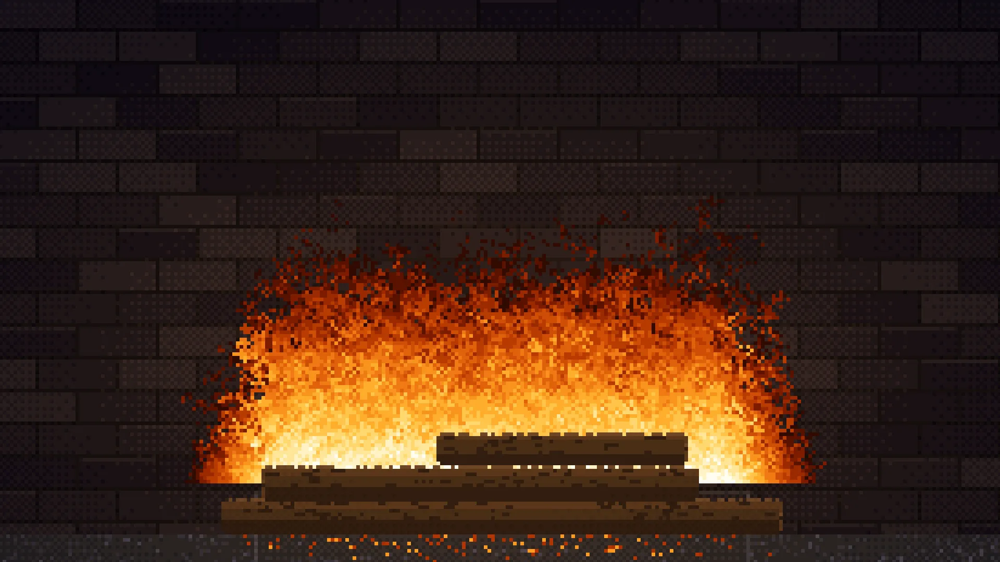

# Fireplace App

A full-screen 8-bit fireplace for Screenly digital signage screens — a burning
pixel-art log pile with drifting embers and firelight moving across the
firebrick behind it.

There is deliberately no drawn surround, mantel or caption: the screen's own
bezel frames the hearth, so the TV itself becomes the mantelpiece.



## How it works

The whole picture is one small canvas — around 280x155 pixels — upscaled by a
whole number of device pixels and drawn with `image-rendering: pixelated`. That
keeps every chunky pixel exactly square from 480x800 up to 4096x2160, and means
the cost per frame barely changes with the display's resolution.

- **Flames** are the classic cellular "Doom fire": heat seeded along the top of
  the log pile, spreading one row up per tick with a little random loss. It runs
  at a fixed 30 ticks per second regardless of the display's refresh rate, and
  is pre-warmed at startup so a screen never shows a cold hearth.
- **Firelight** is palette animation, not per-pixel shading. Each static pixel
  stores a colour plus how exposed it is to the fire; lighting a frame is one
  lookup per pixel against a pre-baked table. The band edges are dithered with
  an ordered 4x4 matrix so the light does not read as concentric rings.
- **Colours** come from a 16-colour scene palette and a 15-step flame ramp.
- **The logs** are composited _over_ the flames, so the fire licks up between
  them, and they are deliberately lit less than the brickwork — a pile lit to
  the same degree turns into pale sandstone rather than firewood.

The brickwork is generated from a seed derived from the screen's hostname, so
each screen gets its own firebox but always looks the same after a restart.

## Configuration

| Setting        | Description                                                     | Required | Default   |
| -------------- | --------------------------------------------------------------- | -------- | --------- |
| `crt_effect`   | Overlay CRT-style scanlines                                     | No       | `false`   |
| `flame_color`  | `classic`, `azure`, `emerald` or `violet`                       | No       | `classic` |
| `flame_height` | `low`, `medium` or `high`                                       | No       | `medium`  |
| `pixel_size`   | `chunky`, `classic` or `fine`                                   | No       | `classic` |
| `scene`        | `hearth` for the log fire, `inferno` for a full screen of flame | No       | `hearth`  |
| `sentry_dsn`   | Sentry DSN for error reporting; leave empty to disable          | No       | _(empty)_ |

An unrecognised value falls back to its default rather than blanking the screen.

The app deliberately ignores the workspace's branding colours: the palette is
fixed, and recolouring it would break the period look. Use `flame_color` to
change the mood instead.

## Getting Started

Install dependencies:

```bash
bun install
```

## Development

```bash
bun run dev
```

## Testing

```bash
bun run test
bun run lint
```

## Build

```bash
bun run build
```

## Screenshots

```bash
bun run screenshots
```

## Deployment

```bash
screenly edge-app create --name fireplace-app --in-place
bun run deploy
screenly edge-app instance create
```
